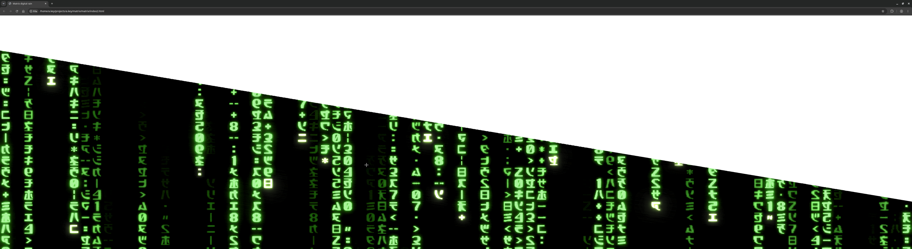

# KDE Plasma Matrix Screensaver & Wallpaper

A fully GPU-accelerated Matrix digital rain effect designed natively for KDE Plasma 6 as a Wallpaper plugin and Screen Locker.

This project is a native QML and Qt shader rewrite of the incredible [web-based Matrix digital rain](https://github.com/rezmason/matrix) created by **Rezmason**.

## Why a rewrite?

While there are methods to run the original WebGL code as a wallpaper in KDE using webview plugins, this approach has a critical flaw for many users. The original WebGL code in combination with AMD/MESA graphics drivers triggers a driver bug that results in a glaring diagonal white artifact cutting across the entire effect. 

By rewriting the rendering pipeline natively using KDE Plasma's QML and Qt's `ShaderEffect` framework, this project:
- Completely bypasses the AMD/MESA driver artifact issue
- Integrates seamlessly and natively into the KDE Plasma 6 desktop environment
- Delivers native GPU performance without the overhead of a Chromium/WebEngine instance

## Features

- **Native KDE Plasma Integration:** Works flawlessly as both a Desktop Wallpaper and Screen Locker.
- **High-Performance Rendering:** Uses direct Qt `ShaderEffect` pipelines (including custom Bloom shaders) to ensure a butter-smooth 60+ FPS without draining CPU.
- **Customizable Configuration:** Full settings panel to easily adjust matrix colors (glint, cursor, background), sizing, density, speed, and bloom intensity right from KDE's System Settings.
- **Automated Releases:** Pre-packaged `.tar.xz` bundles are built automatically and attached to GitHub releases for easy installation.

## Installation

1. Download the latest `matrix-screensaver.tar.xz` from the [Releases tab](../../releases).
2. Install via UI:
   - Open KDE System Settings → Wallpaper (or Screen Locker).
   - Click **"Add New..."** or **"Install from File..."**
   - Select the downloaded `.tar.xz` package.
3. Install via CLI (Alternative):
   - `kpackagetool6 --type Plasma/Wallpaper -i matrix-screensaver.tar.xz`

## Credits & Acknowledgements

The core digital rain mechanics, aesthetic logic, and character sprites are fully credited to **Rezmason** and their amazing [Matrix](https://github.com/rezmason/matrix) project. This native KDE port was built to bring their meticulously crafted digital rain effect to Linux desktop users flawlessly.
